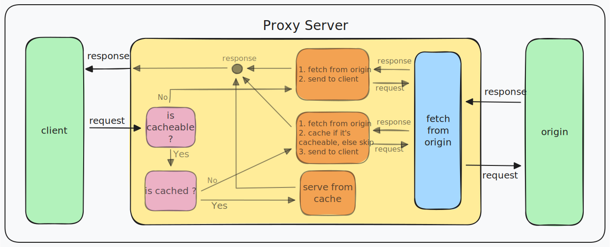
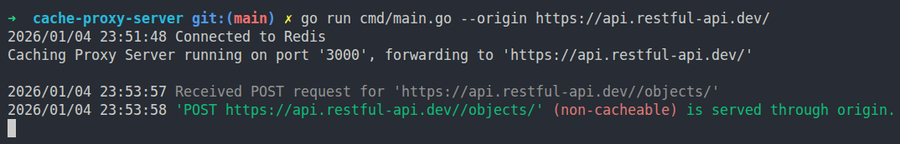
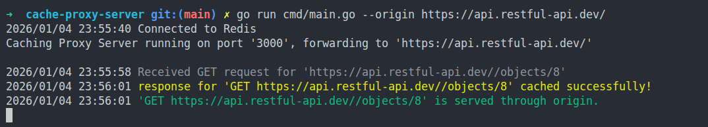
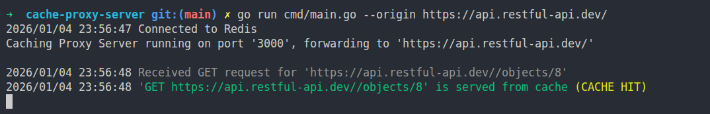

# HTTP Cache Proxy

### Overview :
A simple and lightweight HTTP Caching-Proxy (written in **Go**, backed by **Redis**), designed to reduce latency and improve throughput by efficiently handling repeated HTTP requests (caching them if cacheable, and serve next incoming repeated requests from cache, until they expire...) in high-traffic systems and applications.

**NOTE :** *This project is just a simulation of a **HTTP Cache Proxy**, and it is developed just for educational purposes. (it doesn't support some of advanced HTTP caching policies)*

### features:
- Origin-transparent proxying, acting as a drop-in caching layer without requiring changes to upstream services.
- Implements **HTTP-aware caching policies** to decide which requests and responses are cacheable. e.g.
   - Only Response to **GET** Requests are eligible for caching. <!-- ([check here](...) for more... ) -->
   - Responses containing the **Set-Cookie** header (user-specific data) are never cached. <!-- ([check here](...) for more... ) -->
- CacheEntry abstraction for serializing HTTP responses into Redis, including header normalization and filtering of hop-by-hop headers (e.g. Connection, Transfer-Encoding)
- Structured logging with clear request lifecycle reporting (cache hit, cache miss, origin fetch, errors).
- Graceful shutdown support, ensuring in-flight requests are completed and resources (Redis, network listeners) are properly closed
- Cache hit / miss transparency via X-Cache response headers for easy observability and debugging.

(to understand how this project designed and how it works, see **work cycle explanation** section below)

<br>

## Project Structure
```text
├── docs             # Documentation utils
├── cmd/
│   └── main.go      # Application entry point and bootstrap logic
├── internal/
│   ├── cache/       # Redis integration + caching logic + CacheEntry
│   ├── conf/        # Configuration logic (loading from CLI flags and .env file)
│   ├── log/         # Logger setup and structured logging utilities
│   └── server/      # HTTP proxy server, req/resp handling, and helper utils
├── .env.sample      # Example environment configuration (guide for .env file)
└── ...
```

## How it works (Cache-Proxy work cycle)

<p align="center">
  
</p>

### explanation:

- Listen for incoming HTTP requests from clients
- Evaluated each request against cacheability rules <!-- ([source ref](./internal/server/helpers.go)) -->
- if not cacheable:
   - Forward request directly to the origin server and serve as-is (`X-Cache: CACHE MISS`) ✅ **(cycle ends; next request begins)** <br>
   log reports:
   <p align="center">
      
   </p>
- if cacheable:
   - Check whether a cached response already exists for the request, and... <!-- ([source ref](./internal/server/helpers.go)) -->
   - if a cached response is found:
      - Serve response directly from Redis (`X-Cache: CACHE HIT`) ✅ **(cycle ends; next request begins)** <br>
      log reports:
      <p align="center">
         
      </p>
   - if no cached response exists:
      - Forward request to origin server and fetch the response
      - Validate response for cacheability, and cache it if eligible
      - Send back the response to the client (`X-Cache: CACHE MISS`) ✅ **(cycle ends; next request begins)** <br>
      log reports:
      <p align="center">
         
      </p>

<br>

## Setup and Usage

(This project is under development now. Explanations for this section will be added after completion...)

- ...
- ...

<!-- ### Docket setup, and run :
### Setup from source, and run :
### Usage : -->

<br>

## License
This project is licensed under the **MIT License**. See the [LICENSE File](./LICENSE) for more details.

<br>

**Developed by [hamidgh01](https://github.com/hamidgh01)**
