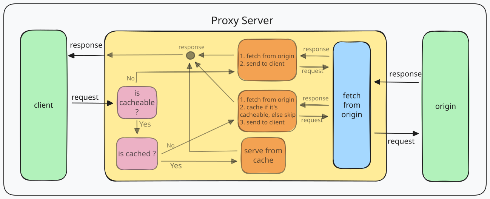

# HTTP Cache Proxy

### Overview:
A simple and lightweight HTTP Caching-Proxy (written in **Go**, backed by **Redis**), designed to reduce latency and improve throughput by efficiently handling repeated HTTP requests (caching them if cacheable, and serve next incoming repeated requests from cache, until they expire...) in high-traffic systems and applications.

**NOTE :** *This project is just a simulation of a **HTTP Cache Proxy**, and it is developed just for educational purposes. (it doesn't support some of advanced HTTP caching policies)*

### features:
- Origin-transparent proxying, acting as a drop-in caching layer without requiring changes to upstream services.
- Implements **HTTP-aware caching policies** to decide which requests and responses are cacheable (check [here](./internal/server/helpers.go)). e.g.
   - Only Response to **GET** Requests are eligible for caching. <!-- ([check here](...) for more... ) -->
   - Responses containing the **Set-Cookie** header (user-specific data) are never cached. <!-- ([check here](...) for more... ) -->
- CacheEntry abstraction for serializing HTTP responses into Redis, including header normalization and filtering of hop-by-hop headers (e.g. Connection, Transfer-Encoding) (check [here](./internal/cache/))
- Structured logging with clear request lifecycle reporting (cache hit, cache miss, origin fetch, errors).
- Graceful shutdown support, ensuring in-flight requests are completed and resources (Redis, network listeners) are properly closed
- Cache HIT/MISS transparency via X-Cache response headers for easy observability and debugging.

(to understand how this project designed and how it works, see [work cycle explanation section](#how-it-works-cache-proxy-work-cycle) below)

<br>

## Project Structure
```text
├── assets           # documentation utils
├── cmd/
│   └── main.go      # application entry point and bootstrap logic
│
├── config/          # load and initialize configurations
│
├── internal/
│   ├── cache/       # CacheService (redis integrated) and CacheEntry
│   └── server/      # HTTP proxy server, req/resp handling, and helper utils
│
├── pkg/
│   └── log/         # logger setup
│
├── .env.sample      # environment configuration sample (guide for `.env` file)
└── ...
```

## How it works (Cache-Proxy-Server work cycle)

<p align="center">
  
</p>

### explanation:

- Listen for incoming HTTP requests from clients
- Evaluated each request against cacheability rules <!-- ([source ref](./internal/server/helpers.go)) -->
- if not cacheable:
   - Forward request directly to the origin server and serve as-is (`X-Cache: CACHE MISS`) ✅ **(cycle ends; next request begins)** <br>
      server logs:
      ```txt
      2026/06/25 16:41:25 [INFO] received 'POST https://jsonplaceholder.typicode.com//posts'
      2026/06/25 16:41:27 [INFO] 'POST https://jsonplaceholder.typicode.com//posts' is served through origin (non-cacheable)
      ```
- if cacheable:
   - Check whether a cached response already exists for the request, and...
   - if no cached response exists:
      - Forward request to origin server and fetch the response
      - Validate response for cacheability, and cache it if eligible
      - Send back the response to the client (`X-Cache: CACHE MISS`) ✅ **(cycle ends; next request begins)** <br>
         server logs:
         ```txt
         2026/06/25 16:42:30 [INFO] received 'GET https://jsonplaceholder.typicode.com//posts/10'
         2026/06/25 16:42:31 [INFO] response for 'GET https://jsonplaceholder.typicode.com//posts/10' cached successfully!
         2026/06/25 16:42:31 [INFO] 'GET https://jsonplaceholder.typicode.com//posts/10' is served through origin.
         ```
   - if a cached response is found:
      - Serve response directly from Redis (`X-Cache: CACHE HIT`) ✅ **(cycle ends; next request begins)** <br>
         server logs:
         ```txt
         2026/06/25 16:43:27 [INFO] received 'GET https://jsonplaceholder.typicode.com//posts/10'
         2026/06/25 16:43:27 [INFO] (CACHE HIT) 'GET https://jsonplaceholder.typicode.com//posts/10' is served from cache
         ```

<br>

## Setup and Usage

- **1. Clone the repository:**
   ```sh
   git clone https://github.com/hamidgh01/cache-proxy.git
   ```
   or [download the zip file](https://github.com/hamidgh01/cache-proxy/archive/refs/heads/main.zip), and unzip

- **2. Install dependencies:**
   ```sh
   cd cache-proxy
   go mod tidy
   ```

- **3. Set up your `.env` file:**

   Copy `.env.sample` to `.env`

   ```sh
   cp .env.sample .env
   ```
   and fill in the needed fields (just REDIS_URL) properly.

- **4. Run the server and pass the origin you want to proxy to `-origin` flag:** <br>

   (I recommend `https://jsonplaceholder.typicode.com/` for test)

   ```sh
   go run ./cmd -origin https://jsonplaceholder.typicode.com/
   ```

   you should see these log messages:

   ```txt
   2026/06/25 16:59:27 [INFO] redis connection established successfully.
   2026/06/25 16:59:27 [INFO] running cache proxy server on port '3000', forwarding to 'https://jsonplaceholder.typicode.com/'
   ```

   **NOTE:** as you can see, the server will run on the `localhost:3000` by default. <br>

   you can modify the **port** using `-port` flag:

   ```sh
   go run ./cmd -port 5000 -origin https://jsonplaceholder.typicode.com/
   ```

   log messages:

   ```txt
   2026/06/25 17:02:07 [INFO] redis connection established successfully.
   2026/06/25 17:02:07 [INFO] running cache proxy server on port '5000', forwarding to 'https://jsonplaceholder.typicode.com/'
   ```

- **5. then request the `path` you want to get from the origin, to your `localhost:port`**

   for example:

   - if you want to request to `https://jsonplaceholder.typicode.com/posts/1`
   - you should pass `/posts/1` to your `http://localhost:port`
   - and just request to `http://localhost:port/posts/1`

   **example:**

   **curl**

   ```sh
   $ curl http://localhost:3000/posts/1
   {
   "userId": 1,
   "id": 1,
   "title": "sunt aut facere repellat ...",
   "body": "quia et suscipit\nsuscipit recusandae consequuntur expedita et cum\nreprehenderit molestiae ut ..."
   }
   ```

   **NOTE:** use `-v` flag with `curl` to see **X-Cache: MISS** or **X-Cache: HIT** header in curl's verbose result

   **server logs**

   ```txt
   2026/06/25 17:06:30 [INFO] received 'GET https://jsonplaceholder.typicode.com//posts/1'
   2026/06/25 17:06:32 [INFO] response for 'GET https://jsonplaceholder.typicode.com//posts/1' cached successfully!
   2026/06/25 17:06:32 [INFO] 'GET https://jsonplaceholder.typicode.com//posts/1' is served through origin.
   ```

<br>

## License
This project is licensed under the **MIT License**. See the [LICENSE File](./LICENSE) for more details.

<br>

**Developed by [hamidgh01](https://github.com/hamidgh01)**
